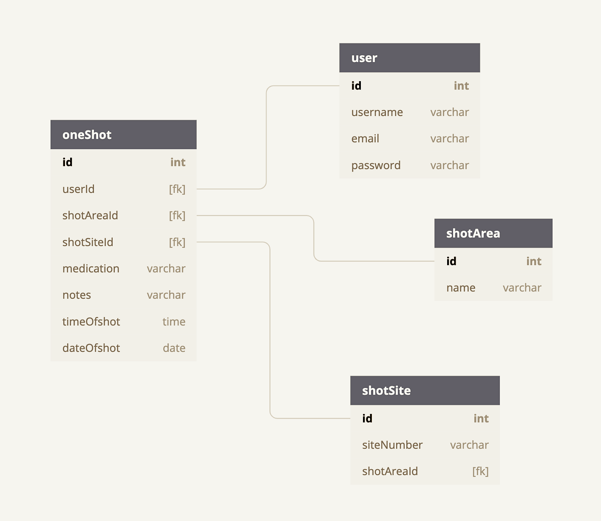

# ShotEase

Shot ease is a simple app that will easily keep track of when and where the user injects medication on their body.  The user can log the injection site, medication, date/time and any pertinent notes they want to add to it.  By having access to the injection history log, the user will know how to rotate their injection sites in order to avoid building hard lumps or fatty deposits under the skin and increase the body's effectiveness in the absorption of their medication. ShotEase is written with the JavaScript framework, React.js.

## Getting Started
To run ShotEase locally, create an empty directory and clone the project by running the following command in your terminal: ``` git@github.com:kgalleg/ShotEase.git```


ShotEase uses a database.json file to store all data. To create the database, run:
```
mkdir api
cd api
touch database.json
```
Open **database.json** and copy the following into the file to create a database skeleton:
```
{
  "user": [
    {
      "id": 1,
      "username": "karla",
      "email": "karla@me.com",
      "password": "karla1"
    },
    {
      "id": 2,
      "username": "ernie",
      "email": "ernie@me.com",
      "password": "karla1"
    },
    {
      "id": 3,
      "username": "moni",
      "email": "moni@me.com",
      "password": "karla1"
    }
  ],
  "oneShot": [
    {
      "id": 23,
      "shotAreaId": "1",
      "shotSiteId": "7",
      "medication": "Novolog",
      "notes": "Ouch! This hurt",
      "date": "2019-08-21",
      "time": "14:23",
      "userId": 6
    },
    {
      "id": 26,
      "shotAreaId": "1",
      "shotSiteId": "2",
      "medication": "Novolog",
      "notes": "hey!",
      "date": "2019-08-09",
      "time": "10:36",
      "userId": 1
    },
    {
      "id": 29,
      "shotAreaId": "2",
      "shotSiteId": "6",
      "medication": "Novolog",
      "notes": "Ouch! Wasn't so bad!",
      "date": "2019-08-19",
      "time": "10:15",
      "userId": 1
    },
    {
      "id": 30,
      "shotAreaId": "1",
      "shotSiteId": "6",
      "medication": "Novolog",
      "notes": "Didn't hurt too bad!",
      "date": "2019-08-19",
      "time": "10:15",
      "userId": 1
    }
  ],
  "shotAreas": [
    {
      "id": 1,
      "name": "abdomen",
      "nameOfArea": "Abdomen",
      "imagePath": "../bodyimages/Abdomen.jpg"
    },
    {
      "id": 2,
      "name": "backOfRightArm",
      "nameOfArea": "Back of Right Arm",
      "imagePath": "../bodyimages/RightArm.jpg"
    },
    {
      "id": 3,
      "name": "backOfLeftArm",
      "nameOfArea": "Back of Left Arm",
      "imagePath": "../bodyimages/LeftArm.jpg"
    },
    {
      "id": 4,
      "name": "backOfRightHip",
      "nameOfArea": "Back of Right Hip",
      "imagePath": "../bodyimages/RightHip.jpg"
    },
    {
      "id": 5,
      "name": "backOfLeftHip",
      "nameOfArea": "Back of Left Hip",
      "imagePath": "../bodyimages/LeftHip.jpg"
    },
    {
      "id": 6,
      "name": "rightThigh",
      "nameOfArea": "Right Thigh",
      "imagePath": "../bodyimages/RightThigh.jpg"
    },
    {
      "id": 7,
      "name": "leftThigh",
      "nameOfArea": "Left Thigh",
      "imagePath": "../bodyimages/LeftThigh.jpg"
    }
  ],
  "shotSite": [
    {
      "id": 1,
      "shotAreaId": 1,
      "siteNumber": "1"
    },
    {
      "id": 2,
      "shotAreaId": 1,
      "siteNumber": "2"
    },
    {
      "id": 3,
      "shotAreaId": 1,
      "siteNumber": "3"
    },
    {
      "id": 4,
      "shotAreaId": 1,
      "siteNumber": "4"
    },
    {
      "id": 5,
      "shotAreaId": 1,
      "siteNumber": "5"
    },
    {
      "id": 6,
      "shotAreaId": 1,
      "siteNumber": "6"
    },
    {
      "id": 7,
      "shotAreaId": 1,
      "siteNumber": "7"
    },
    {
      "id": 8,
      "shotAreaId": 1,
      "siteNumber": "8"
    },
    {
      "id": 9,
      "shotAreaId": 1,
      "siteNumber": "9"
    },
    {
      "id": 10,
      "shotAreaId": 1,
      "siteNumber": "10"
    },
    {
      "id": 11,
      "shotAreaId": 1,
      "siteNumber": "11"
    },
    {
      "id": 12,
      "shotAreaId": 1,
      "siteNumber": "12"
    }
  ]
}
```

Traverse back the ShotEase folder and run: ```npm install```
This is will install all packages, libraries and their dependencies used by Take A Hike.
Next  run the following in order to view Take A Hike in your browser: ```npm start```
Open [http://localhost:3000]( http://localhost:3000) to view it in the browser.
In another window of your terminal go into the ```src/api``` folder and run: ```json-server -p 5002 -w database.json```

## Entity Relationship Diagrams


## Technologies Used


## Visualization of ShotEase


## Enjoy ShotEase
This project was bootstrapped with [Create React App](https://github.com/facebook/create-react-app).
### Author
[Karla Gallegos](https://github.com/kgalleg)
